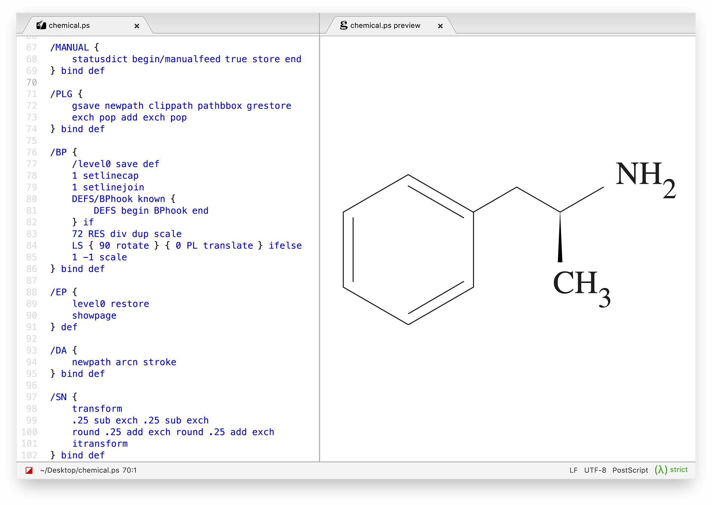

PostScript support for Atom
===========================

Live previews of PostScript/EPS files using [GhostScript][].

To preview an `.eps` or `.ps` file, press <kbd>CTRL + Shift + M</kbd>.

Installation
--------------------------------------------------------------------------------
1. **Install GhostScript if needed.**  
	[Download] a precompiled binary or install using a package manager.

	On Linux, using [APT][], [DNF][], et al:
	~~~shell
	# Debian/Ubuntu
	sudo apt-get update
	sudo apt-get install ghostscript

	# RPM-based distros
	sudo yum install ghostscript
	~~~

	On macOS, using [Homebrew][] or [MacPorts][]:
	~~~shell
	# Homebrew
	brew install ghostscript
	
	# MacPorts
	sudo port install ghostscript
	~~~

	On Windows, using [Chocolatey][]:
	~~~batchfile
	choco install ghostscript
	~~~

2.	**Clone this repository to `~/.atom/packages` using [Git][].**  
	After checkout, install libraries needed by this package's UI:

	On Linux and macOS:
	~~~shell
	cd ~/.atom/packages
	git clone 'https://github.com/Alhadis/Atom-PostScript.git' postscript
	cd postscript
	apm install .
	apm install --production file-icons
	~~~

	On Windows:
	~~~batchfile
	cd %HOMEPATH%\.atom\packages
	git clone "https://github.com/Alhadis/Atom-PostScript.git"
	ren Atom-PostScript postscript
	cd postscript
	apm install --production file-icons

	:: Node.js is required on Windows due to a bug in APM
	npm install --production .
	~~~

<!-- Referenced links --------------------------------------------------------->
[APT]:         https://wiki.debian.org/AptCLI
[Chocolatey]:  https://chocolatey.org/
[DNF]:         https://docs.fedoraproject.org/en-US/quick-docs/dnf/
[download]:    https://www.ghostscript.com/download/gsdnld.html
[GhostScript]: https://www.ghostscript.com/
[Git]:         https://git-scm.com/
[Homebrew]:    https://brew.sh/
[MacPorts]:    https://ports.macports.org/port/ghostscript/
