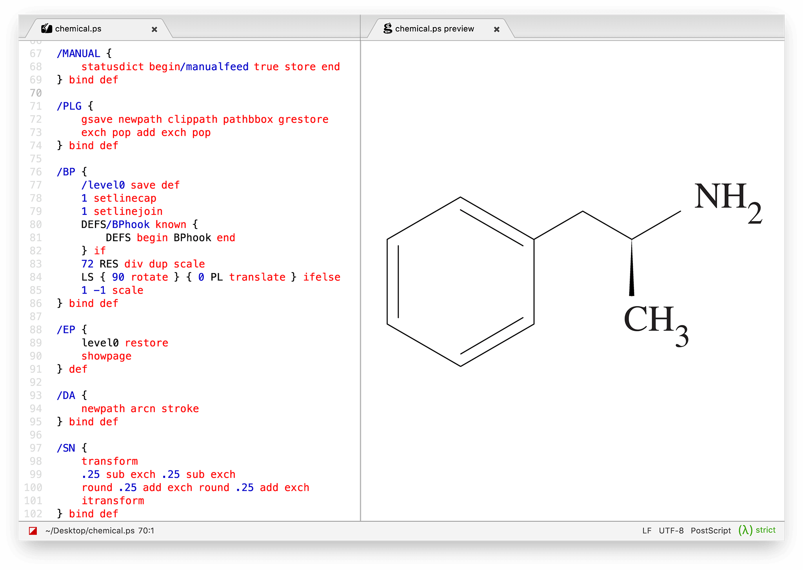

PostScript support for Atom
===========================

Live previews of PostScript/EPS files using [GhostScript][].

To display the previewer, open an `.eps` or `.ps` file and press <kbd>CTRL + Shift + M</kbd>.

Installation
--------------------------------------------------------------------------------
This package requires [GhostScript][download],
so make sure it's installed before trying this out.

**On Linux:**
~~~bash
# Debian/Ubuntu
$ sudo apt-get update
$ sudo apt-get install ghostscript

# RPM-based distros
$ sudo yum install ghostscript
~~~

**On macOS, using [Homebrew][]:**
~~~console
$ brew install ghostscript
~~~

**On Windows, using [Chocolatey][]:**
~~~batch
C:\> choco install ghostscript
~~~

Or simply [download][] a precompiled binary, and install manually.

[GhostScript]: https://www.ghostscript.com/
[download]:    https://www.ghostscript.com/download/gsdnld.html
[Homebrew]:    https://brew.sh/
[Chocolatey]:  https://chocolatey.org/
